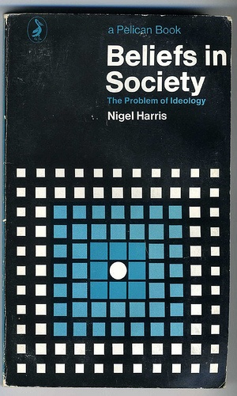

# sketches using ... canvas-sketch

- https://github.com/mattdesl/canvas-sketch
- https://github.com/mattdesl/canvas-sketch/blob/master/docs/README.md

`npx canvas-sketch-cli sketches/index.js --output=output/ --stream`

`npx canvas-sketch-cli sketches/sketch.js --new --template=p5`

`npx canvas-sketch-cli sketches/sketch.js --dir dist --build`

## trying out fragment-tools

https://github.com/raphaelameaume/fragment/

## insidious-motorcycle

- manually inc/dec vectors/vector amounts
- zoom in/out of source
- rewind - go forward/backward with the vectors
- https://www.gorillasun.de/blog/a-guide-to-making-gifs-in-p5js-and-processing/ noise loops
- work from center or other locations instead of just "upper-left"
- image inset offsets like this book design:
  

- https://github.com/VadimGouskov/pretty-grid

## image-shaper

- originally @ https://editor.p5js.org/MichaelPaulukonis/sketches/cg_LK7asX
- used to create a zipped pair of a cutout image with the vectors of that cutout
- the file is then imported by another collage-program of mine

### roadmap

- shape "library"
  - see the thing used for .... that other thing.
  - the one that was mostly dumb html
- load existing vectors onto image
- standard shapes
  - including text <https://erraticgenerator.com/blog/p5js-texttopoints-function/>
- bezier curves, wooo!
- ~~rotation~~
- ~~edit vectors once drawn (prior to render)~~
- better handling of in/out sizes
  - semi-handled, but we should display size and allow shrinking
- some semblance of a UI
- https://programmingdesignsystems.com/shape/custom-shapes/index.html
  - https://programmingdesignsystems.com/shape/procedural-shapes/index.html
  - contours are the p5js term for "holes" in a shape
- shapes https://github.com/gaba5/p5.shape.js
- https://c2js.org/examples.html?name=Chromosome3

## nova.zombie.simulator

### audio

Bone Crunch by Clearwavsound -- https://freesound.org/s/524609/ -- License: Attribution 3.0

wilhelm_scream.wav by Syna-Max -- https://freesound.org/s/64940/ -- License: Attribution NonCommercial 4.0

Layered Gunshot 7.wav by Xenonn -- https://freesound.org/s/128297/ -- License: Creative Commons 0

Carpenter meets Tron Seq (120 BPM).wav by Xinematix -- https://freesound.org/s/262442/ -- License: Attribution 4.0

Loopy Thing.wav by jarethorin -- https://freesound.org/s/425941/ -- License: Creative Commons 0

## Agressive Text Waves

If I told you this bore a resemblance to XRAYSMONALISA would that mean anything to you?

